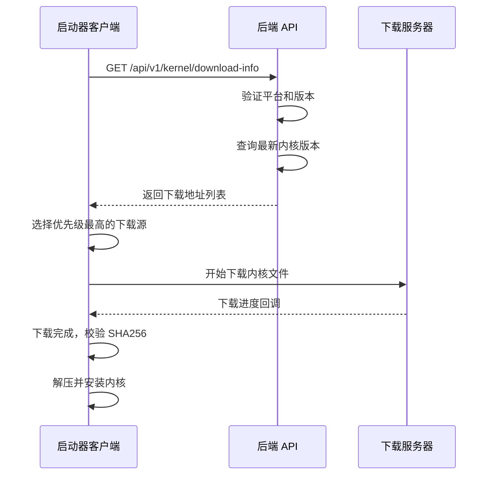

# 内核下载地址 API 接口设计规范

## 1. 接口概述

| 项目 | 说明 |
|------|------|
| **接口名称** | 获取内核下载信息 |
| **请求方式** | GET |
| **接口路径** | `/api/v1/kernel/download-info` |
| **功能描述** | 根据客户端平台和版本，返回最适合的内核下载地址 |

---

## 2. 请求参数

### Query Parameters

| 参数名 | 类型 | 必填 | 说明 | 示例 |
|--------|------|------|------|------|
| `platform` | string | 是 | 操作系统平台 | `windows`, `darwin`, `linux` |
| `arch` | string | 是 | CPU 架构 | `x86_64`, `aarch64` |
| `launcher_version` | string | 是 | 启动器当前版本 | `0.3.0` |
| `current_kernel_version` | string | 否 | 当前已安装的内核版本 | `146` |

### 请求示例

```http
GET /api/v1/kernel/download-info?platform=windows&arch=x86_64&launcher_version=0.3.0
```

---

## 3. 响应格式

### 成功响应 (HTTP 200)

```json
{
  "code": 0,
  "message": "success",
  "data": {
    "has_update": true,
    "version": "146",
    "release_date": "2026-02-01",
    "changelog": "性能优化，修复指纹检测问题",
    "file_size": 268435456,
    "file_hash": "sha256:a1b2c3d4e5f6...",
    "min_launcher_version": "0.2.0",
    "downloads": [
      {
        "id": "github",
        "name": "GitHub (推荐)",
        "url": "https://github.com/user/repo/releases/download/v146/chromium-146-windows-x64.zip",
        "priority": 1
      },
      {
        "id": "mirror_cn",
        "name": "国内镜像",
        "url": "https://mirror.example.cn/chromium/146/chromium-146-windows-x64.zip",
        "priority": 2
      },
      {
        "id": "cdn",
        "name": "CDN 加速",
        "url": "https://cdn.example.com/chromium/146/chromium-146-windows-x64.zip",
        "priority": 3
      }
    ]
  }
}
```

### 无更新响应 (HTTP 200)

```json
{
  "code": 0,
  "message": "success",
  "data": {
    "has_update": false,
    "version": "146",
    "current_is_latest": true
  }
}
```

### 错误响应

```json
{
  "code": 1001,
  "message": "不支持的平台类型",
  "data": null
}
```

---

## 4. 响应字段说明

### `data` 对象

| 字段名 | 类型 | 说明 |
|--------|------|------|
| `has_update` | boolean | 是否有可用更新/下载 |
| `version` | string | 内核版本号 |
| `release_date` | string | 发布日期 (ISO 8601) |
| `changelog` | string | 更新说明 |
| `file_size` | number | 文件大小 (字节) |
| `file_hash` | string | 文件校验值 (sha256) |
| `min_launcher_version` | string | 要求的最低启动器版本 |
| `downloads` | array | 下载源列表 |

### `downloads[]` 对象

| 字段名 | 类型 | 说明 |
|--------|------|------|
| `id` | string | 下载源唯一标识 |
| `name` | string | 下载源显示名称 |
| `url` | string | 下载地址 |
| `priority` | number | 优先级 (1 最高) |

---

## 5. 错误码定义

| 错误码 | 说明 |
|--------|------|
| `0` | 成功 |
| `1001` | 缺少必要参数 (platform / arch / launcher_version) |
| `1002` | 未找到适配的内核版本 |
| `1003` | 启动器版本过低，需要先更新启动器 |
| `5000` | 服务器内部错误 |

---

## 6. 后端实现示例 (Rust/Axum)

```rust
use axum::{extract::Query, Json};
use serde::{Deserialize, Serialize};

#[derive(Deserialize)]
pub struct KernelDownloadQuery {
    platform: String,
    arch: String,
    launcher_version: String,
    current_kernel_version: Option<String>,
}

#[derive(Serialize)]
pub struct ApiResponse<T> {
    code: i32,
    message: String,
    data: Option<T>,
}

#[derive(Serialize)]
pub struct DownloadSource {
    id: String,
    name: String,
    url: String,
    priority: u8,
}

#[derive(Serialize)]
pub struct KernelDownloadInfo {
    has_update: bool,
    version: String,
    release_date: Option<String>,
    changelog: Option<String>,
    file_size: Option<u64>,
    file_hash: Option<String>,
    min_launcher_version: Option<String>,
    downloads: Option<Vec<DownloadSource>>,
}

pub async fn get_kernel_download_info(
    Query(params): Query<KernelDownloadQuery>,
) -> Json<ApiResponse<KernelDownloadInfo>> {
    // 1. 验证平台
    let valid_platforms = ["windows", "darwin", "linux"];
    if !valid_platforms.contains(&params.platform.as_str()) {
        return Json(ApiResponse {
            code: 1001,
            message: "不支持的平台类型".to_string(),
            data: None,
        });
    }

    // 2. 验证架构
    let valid_archs = ["x86_64", "aarch64"];
    if !valid_archs.contains(&params.arch.as_str()) {
        return Json(ApiResponse {
            code: 1002,
            message: "不支持的 CPU 架构".to_string(),
            data: None,
        });
    }

    // 3. 查询最新内核版本 (从数据库或配置)
    let latest_version = "146";
    
    // 4. 构建下载地址
    let filename = format!(
        "chromium-{}-{}-{}.zip",
        latest_version,
        params.platform,
        params.arch
    );

    let downloads = vec![
        DownloadSource {
            id: "github".to_string(),
            name: "GitHub (推荐)".to_string(),
            url: format!(
                "https://github.com/user/repo/releases/download/v{}/{}",
                latest_version, filename
            ),
            priority: 1,
        },
        DownloadSource {
            id: "mirror_cn".to_string(),
            name: "国内镜像".to_string(),
            url: format!(
                "https://mirror.example.cn/chromium/{}/{}",
                latest_version, filename
            ),
            priority: 2,
        },
    ];

    // 5. 返回结果
    Json(ApiResponse {
        code: 0,
        message: "success".to_string(),
        data: Some(KernelDownloadInfo {
            has_update: true,
            version: latest_version.to_string(),
            release_date: Some("2026-02-01".to_string()),
            changelog: Some("性能优化，修复指纹检测问题".to_string()),
            file_size: Some(268435456),
            file_hash: Some("sha256:a1b2c3d4...".to_string()),
            min_launcher_version: Some("0.2.0".to_string()),
            downloads: Some(downloads),
        }),
    })
}
```

---

## 7. 数据库表设计 (可选)

```sql
-- 内核版本表
CREATE TABLE kernel_versions (
    id INTEGER PRIMARY KEY AUTOINCREMENT,
    version VARCHAR(20) NOT NULL,
    platform VARCHAR(20) NOT NULL,  -- windows/darwin/linux
    arch VARCHAR(20) NOT NULL,       -- x86_64/aarch64
    release_date DATE NOT NULL,
    changelog TEXT,
    file_size BIGINT,
    file_hash VARCHAR(128),
    min_launcher_version VARCHAR(20),
    is_active BOOLEAN DEFAULT TRUE,
    created_at TIMESTAMP DEFAULT CURRENT_TIMESTAMP
);

-- 下载源表
CREATE TABLE download_sources (
    id INTEGER PRIMARY KEY AUTOINCREMENT,
    kernel_version_id INTEGER REFERENCES kernel_versions(id),
    source_id VARCHAR(50) NOT NULL,
    source_name VARCHAR(100) NOT NULL,
    url TEXT NOT NULL,
    priority INTEGER DEFAULT 1,
    is_active BOOLEAN DEFAULT TRUE
);
```

---

## 8. 安全考虑

| 安全项 | 措施 |
|--------|------|
| **请求频率限制** | 单 IP 每分钟最多 10 次请求 |
| **文件校验** | 提供 SHA256 哈希值，客户端下载后校验 |
| **HTTPS** | 必须使用 HTTPS 传输 |
| **URL 有效期** | CDN 地址可设置签名有效期 |
| **版本兼容** | 检查启动器版本，防止不兼容的内核被下载 |

---

## 9. 客户端调用示例

### 前端调用 (TypeScript)

```typescript
import { invoke } from '@tauri-apps/api/core'

interface KernelDownloadInfo {
  has_update: boolean
  version: string
  downloads?: Array<{
    id: string
    name: string
    url: string
    priority: number
  }>
}

async function getKernelDownloadUrl(): Promise<string> {
  try {
    // 方式1: 直接调用 HTTP API
    const response = await fetch(
      'https://api.example.com/api/v1/kernel/download-info' +
      '?platform=windows&arch=x86_64&launcher_version=0.3.0'
    )
    const result = await response.json()
    
    if (result.code === 0 && result.data.downloads?.length > 0) {
      // 返回优先级最高的下载地址
      return result.data.downloads[0].url
    }
  } catch (error) {
    console.error('获取下载地址失败:', error)
  }
  
  // 降级：使用默认地址
  return 'https://github.com/user/repo/releases/download/v146/chromium-146-windows-x64.zip'
}
```

---

## 10. 版本更新日志

| 版本 | 日期 | 变更内容 |
|------|------|----------|
| v1.0 | 2026-02-07 | 初始版本，定义基础接口规范 |

---

## 附录：完整工作流程



---

**文档维护者:** 触宝开发团队  
**最后更新:** 2026-02-07
